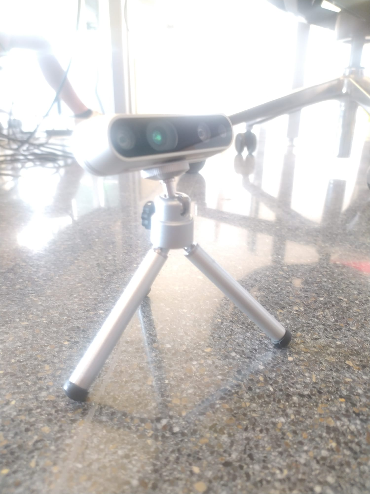
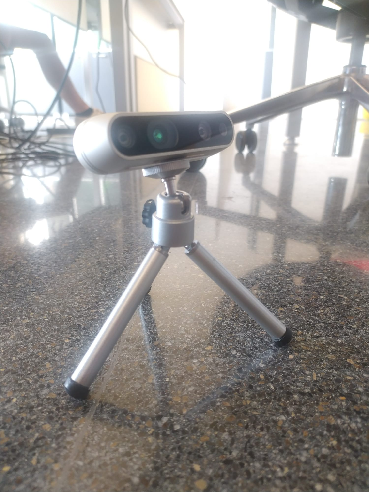
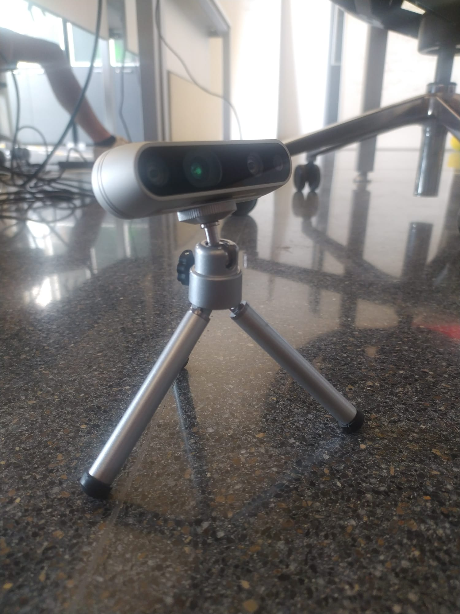
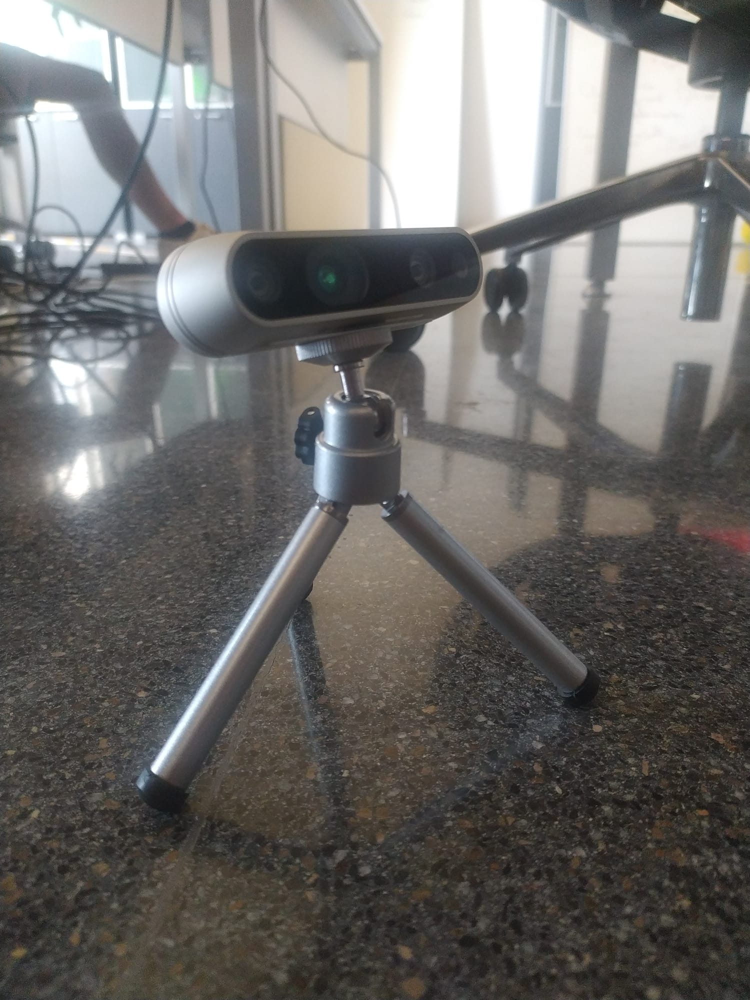
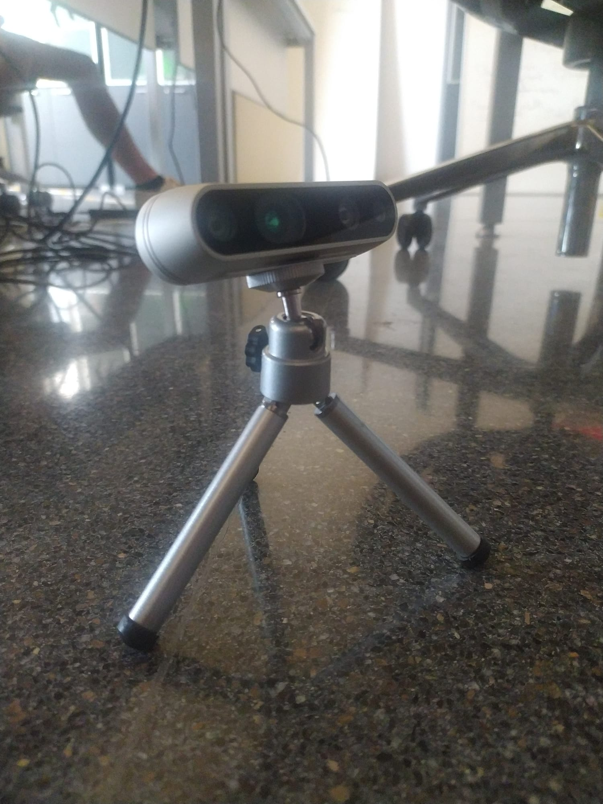
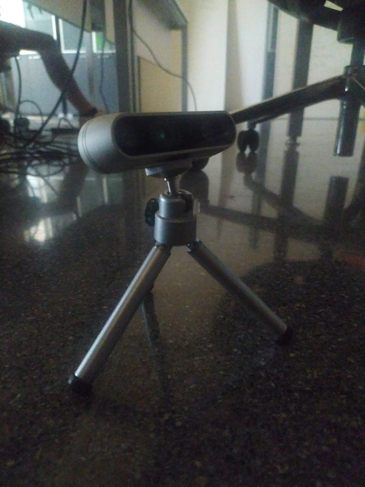
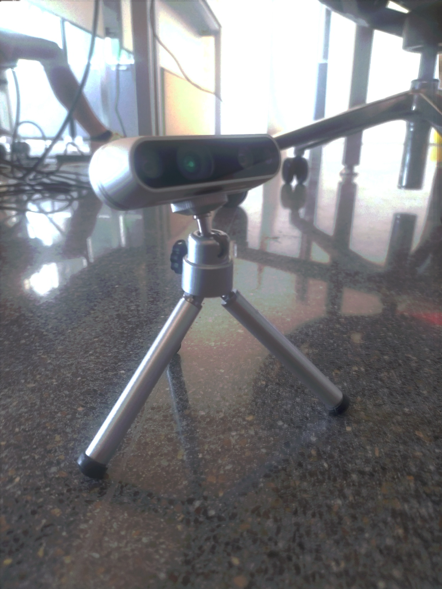
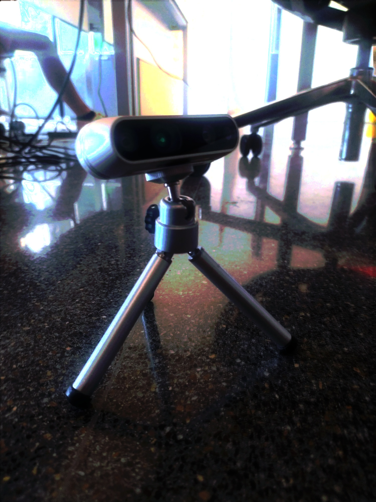
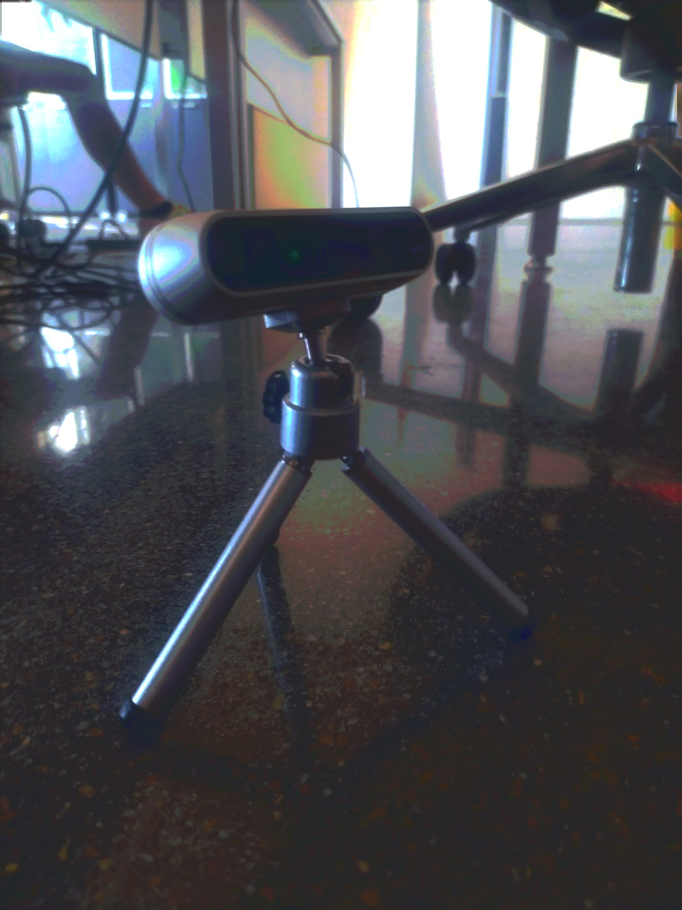
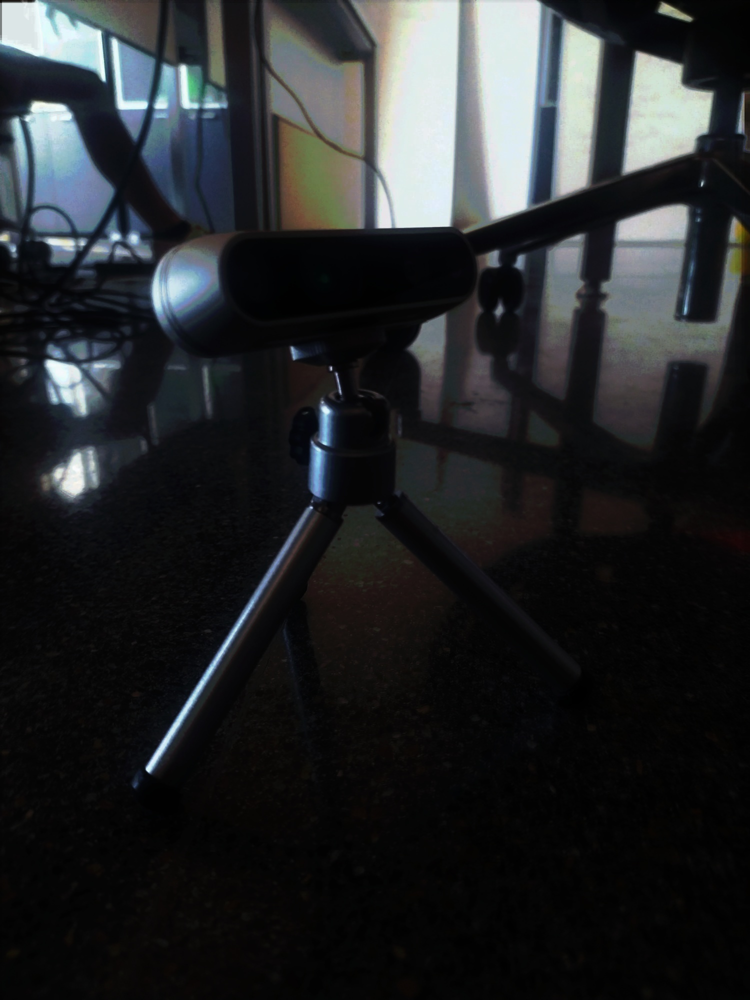

# Opencv-HDR-demo
High-dynamic-range tone mapping with a diferents algorithms

# Example

### Imputs
<table>
  <tr>
    <td>ISO: 1/4s</td>
    <td>ISO: 1/8s</td>
    <td>ISO: 1/15s</td>
    <td>ISO: 1/60s</td>
    <td>ISO: 1/120s</td>
    <td>ISO: 1/1000s</td>
  </tr>
  <tr>
    <td></td>
    <td></td>
    <td></td>
    <td></td>
    <td></td>
    <td></td>
  </tr>
 </table>
 
 ### Results
 
 <table>
  <tr>
    <td>Debevec's method</td>
    <td>Drago's method</td>
    <td>Mantiuk's method</td>
    <td>Reinhard's method</td>
  </tr>
  <tr>
    <td></td>
    <td></td>
    <td></td>
    <td></td>
  </tr>
    <td>gama=2</td>
    <td>gama=1, saturation=0.7, bias=0.85</td>
    <td>gama=2.2, scale=0.85, saturation=1.2</td>
    <td>gama=1.5, intensity=0, light_adapt=1, color_adapt=0</td>
  </tr>
 </table>
 

